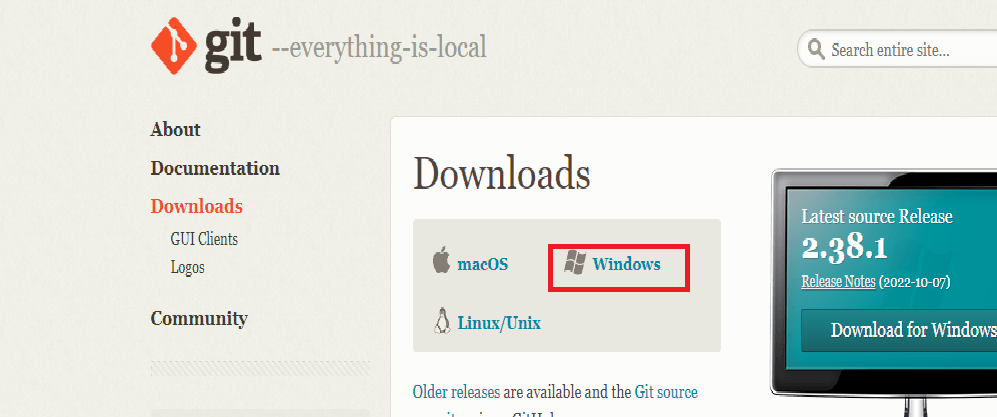
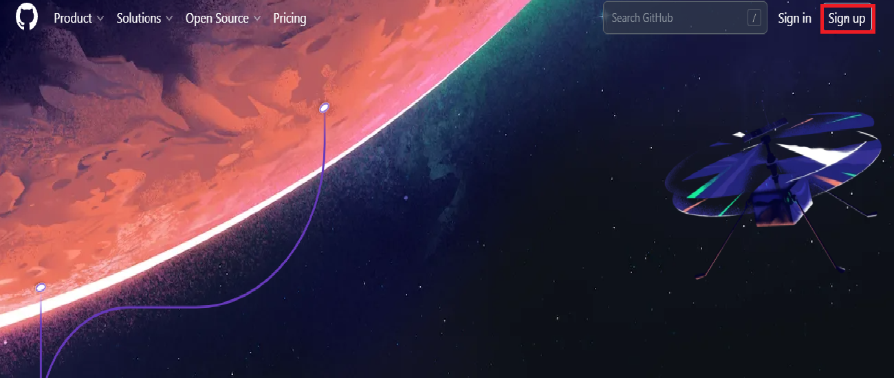
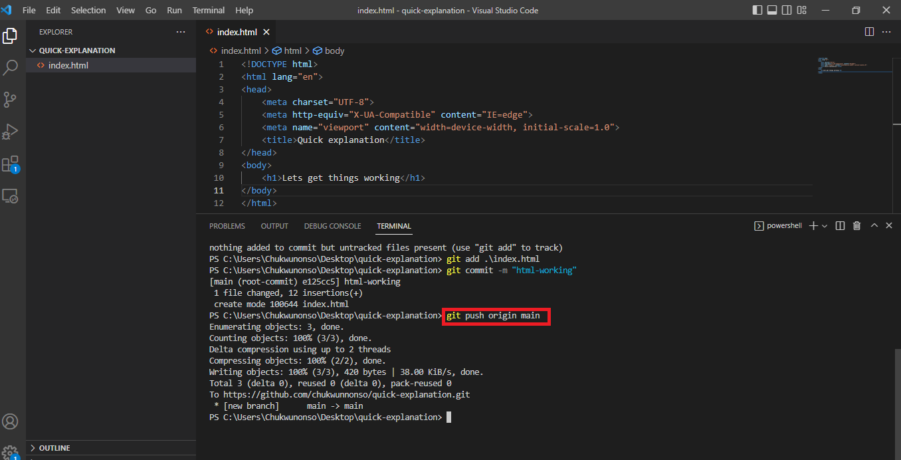
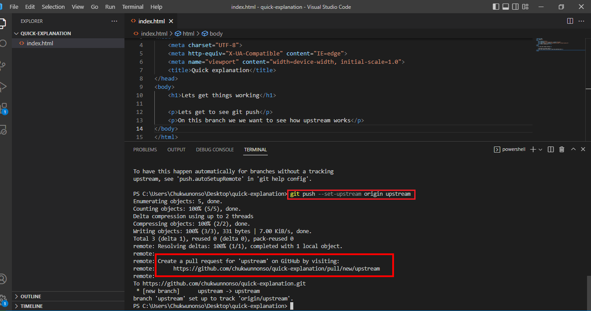
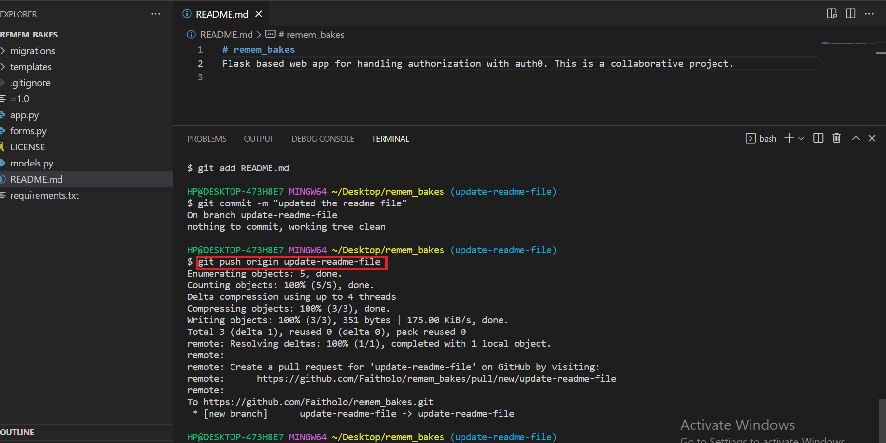
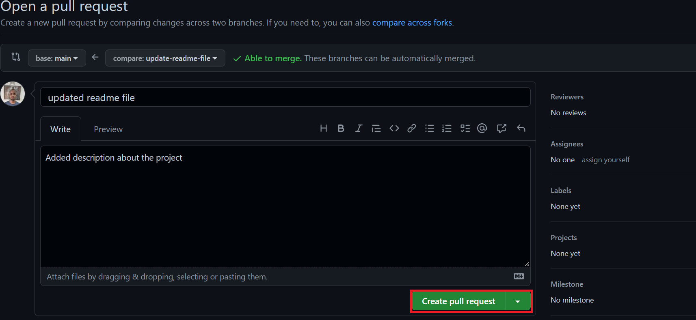
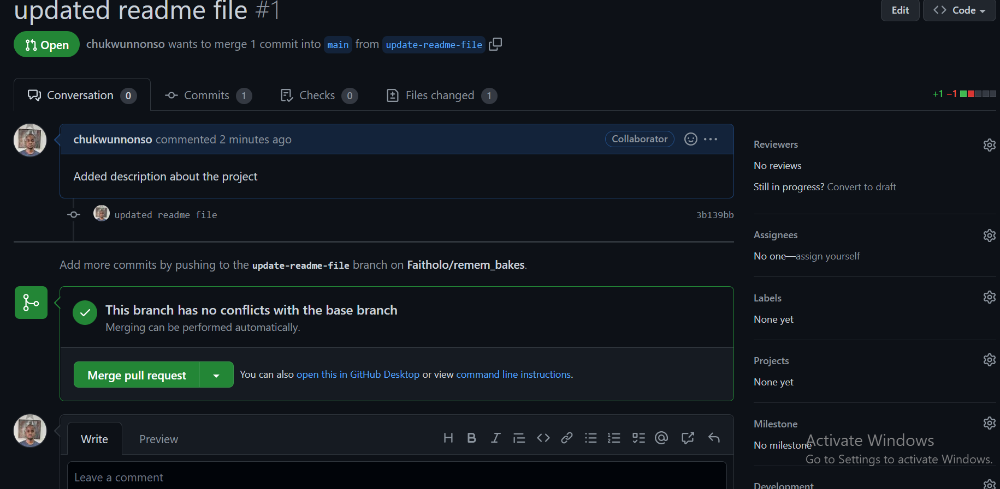
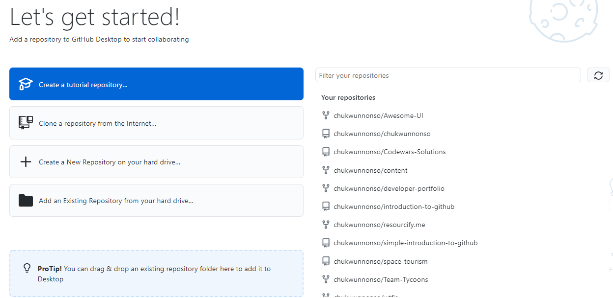

# Introduction to GitHub
You don't have to lose your projects or struggle with collaborating anymore.

* Table of Contents
    - Introduction
    - What is Git? 
    - What is GitHub?
    - Why GitHub?
    - Git vs. GitHub
    - What is Cloning?
        - How to clone?
    - What is Commit? 
      - How to commit
  - What is Git Push?
      - How do we push?? 
  - Why Pull Request? 
    - How to make a pull request?
  - GitHub Desktop vs. Github CLI
  
## Introduction

Working on fascinating projects is usually enjoyable. However, we need to secure the project, track progress and even work alongside others.

You may have been told "make sure you have a backup". Well, before the invent of GitHub, developers used punch cards and even USB flash drives for backups. Aside the burden of updating the project after making changes and ensuring the device is well secured, collaboration was hell. Let's discuss how to maximize GitHub while working on projects.

## What is Git?

 Git is a distributed version control system (DVCS), meaning your local machine gets a mirror copy of the source code and history. Globally, `Git` is the most adopted version control system in terms of popularity. We could credit this widespread adoption to its compatibility on Windows, MacOS, and Linux Operating System. Repositories on Git are local repositories and can be lost.
 
Download [Git](https://git-scm.com/.) here. <br><br>




## What is GitHub?
GitHub is a platform for hosting ` Git ` repositories on a distant server on the internet. Repositories on `GitHub` are safe and can be accessed from anywhere by you if it is private or seen by everyone on the internet if it is a public repository. Repositories on GitHub are called remote repositories.

Collaborating with developers across the globe is straightforward using GitHub and you can improve your skills by contributing to  [open source](https://opensource.com/resources/what-open-source) projects. Git is very essential to GitHub.


*Repository or Repo as some may call it means folder.* 

Sign up with [GitHub](https://github.com/) to get started.


<br><br><br>

## Git vs Github

| Git      | GitHub |
| ----------- | ----------- |
| Git can protect your project from anywhere even without an online connection      | GitHub requires connection to save your work on the remote server.       |
|  Git is a software   | GitHub is a service        |
|  Git is distributed.    | GitHub is centralized. It is controlled by an authority.       |
| Git does not manage user data.      | GitHub  manages user data.       |
| Git was created by Linus Torvalds.      | GitHub  was collectively created by Chris Wanstrath, P. J. Hyett, Tom Preston-Werner, and Scott Chacon       |
| Git is written in C programming language      | GitHub  is developed with Ruby on Rails       |
| Git was first launched in 2005.      | GitHub was launched in 2008.      |
| Local repositories on Git is seen by only you      | Remote repository on GitHub can be pivate or public.       |

<br>

## Why GitHub?

| Features      | Why use GitHUB |
| ----------- | ----------- |
| 1. Versatility      | GitHub is suitable for seasoned developer, early career programmers,  designers and writers.       |
| 2. Socials   | You can easily collaborate with other developers from across the globe using GitHub.        |
|3.Productivity    |  GitHub simplifies working independently on a personal project and with a team for a collective projects. |
| 4. [Open source](https://opensource.com/resources/) |  GitHub hosts millions of free repository you can improve upon and learn new concepts from.  |
| 5. Education    |  With [GitHub education](https://education.github.com/benefits?type=student/), you can access free quality resources and gain on demand skills.        |
| 6. Portfolio    |  GitHub showcases personal projects and can be used as portfolio when applying for jobs and grants.   | 

<br><br>
I will be using Visual Studio Code as my Integrated Development Environment. To open the terminal use:

       cmd + ~


<br> <br>
 * Summary of some important Git commands.

    * `git status`: This command gives a summary of our directory. Both staged and unstaged files are shown when we use this git status. 


   * `git add`: One of the most used and simple to remember commands. To stage a file, use this command. Staged files can be saved using `git commit`. 

                    ``` 
                    git add [file name]
                         
                    git add [file name] [file name] [file name] 
                
                    git add . 

                    ```

        *git add . stages all files.*

<br><br>

### What is Cloning? 

`Git clone` copies a repository that already exists into your machine. It provides all the files and history of the codebase. Cloning can be done using `HTTPS` or `SSH`. Hands-on, lets clone a repository using HTTPS. 

 *How do we clone?*

 

    When you find the project you want to clone... 

    1. Click on the *fork* button
    2. Click on the *code* button located on the right side of the screen beside the *Go to file* and *add file*.
    3. Copy the `HTTPS url`. 
    4. Move into your desktop folder in your terminal. This can be Git or the intgrated terminal like we have in VS Code.
    5. Type  `git clone`  and paste the `HTTPS url` then hit enter. You have cloned your first repository.<br><br>

Step four and five above is done as shown below.

 ```
    cd Desktop
    git clone HTTPS 
``` 

<br>

<br>


<br>

### What is Commit? 

`Git commit` is always preceded by `git add`. The `git commit`  takes  snapshots. Changes made to a file are not saved by `git status` or `git add`. To save changes, use `git commit`. Committed files represent a safe version of your project. This files will only be modified when you instruct Git to do so.Without `git commit`, the remote repository cannot be updated and only staged files can be committed. 


  *How to commit?*

        git add [file name]

        git commit -m "changed components to class"

 
The flag `-m` stands for message.<br>

 *To correct an error in commit message use*


        git commit --amend “This is the correct message”


### What is git push?

Whenever you run the git push command, what you're doing is transferring everything in the local repository to the remote repository. The `git push`  unifies both local and remote repositories. The `git add` and `git commit`, precedes `git push`.
Without pushing the local repository, although this repository has been saved, it is not secured.
The opposing command, `git fetch` takes our code from the remote to the local repository while git push uploads to GitHub. 


*How do we push?*


```
    git push

    git push <remote> <branch>
```
<br><br>

<br><br>

Git presumes you want to push to the origin when you execute `git push` on the main branch. Therefore, git ultimately executes the `git push origin main` command.

<br><br>

```
    git push --set-upstream origin <branch name>;
```

After modifying a new branch, using `git push` will not move our branch to the remote. To achieve this, you need the command above.

The --set-upstream will use remote as the upstream directory before pushing . And with the help of the branch, we keep track of the remote branch.

<br><br>

By using the command `git push --set-upstream`, you can initiate a new pull request so that your code can be reviewed to determine if it is what is required before merging.  

```
    git push <remote> --force
```

The `git push origin --force` overwrites the remote content forcefully with the local repository we pushed. Ensure you use this command with caution because unlike `git push --set-upstream`,  the `git push --force` simply replaces everything with the local repository on the assumption that you absolutely want all the contents of the branch. <br><br>

 
* Summary of some advanced commands
   * Git fetch: Changes are downloaded to the local repository using `git fetch` from the remote repository. Git fetch allows us to compare local and remote repositories side by side.
 
   * Git merge: The `git merge` command syncs the local repository with the fetched remote repository.

   * Git pull: The commands `git fetch` and `git merge` are executed simultaneously by `git pull`. The remote repository is used to automatically replace the local repository.<br> <br><br>
  
  Learn more about these commands [here](https://www.atlassian.com/git/tutorials/syncing/git-fetch)
  


### Why Pull Request? 

Collaboration is one key features of GitHub. Effective team work necessitates communication. When you pull request, the project owner examines the changes and either accept or reject the change. Pull request helps with efficient communication. You can perform pull requests via GitHub, GitHub Desktop, GITHUB CLI, etc. After submitting a pull request, a page comparing the two branches will show up so you can view the differences. 

  *How to make a pull request?*

<br>


Create a new branch called *update-readme-file* and switch to it using the command:    


```
git checkout -b “update-readme-file” 
 ```   
    
    


<br>    
 Make changes in your newly created branch. Then:

   1. git status 
   2. git diff
   3. git add file name or git add . to add all
   4. git commit -m “updated-readme-file”
   5. git push origin update-readme-file <br><br>


 <br><br>
 <br><br>
 <br><br>


Go back to [GitHub](https://github.com/). If you followed the steps,  a green button should pop up with the message *compare and pull request* click it, give a descrription of the change you made then create pull request. 


<br><br>

<br><br>

<br><br>

*If your pull request is accepted,  the change will be implemented.* <br><br>


### GitHub Desktop
 In a nutshell, GitHub Desktop makes working with local and hosted repositories simple. `GitHub desktop` Eliminates any potential roadblocks and Increases your productivity.

Download [GitHub](https://desktop.github.com/) to your computer.




### GitHub CLI

GitHub CLI stands for GitHub Command Line Interface. It connects GitHub to your terminal without switching applications. 

Think of the `GitHub CLI` when you consider ease. GitHub CLI makes you accustomed to working with the terminal - a crucial skill. 


Install [GitHub CLI](https://cli.github.com/).

Run this command in the terminal

```
    gh auth login
```


## GitHub Desktop vs. Github CLI

| GitHub CLI      | GitHub Desktop |
| ----------- | ----------- |
| GitHub CLI is an interface in your terminal      | GitHub desktop uses Graphic User Interface       |
|  GitHub CLI is a command line tool   | GitHub desktop is an application.        |
| GitHub CLI uses commands     | GitHub desktop less commands.       |
| Downloading GitHub CLI takes smaller memory.       | GitHub desktop requires more memory space.      |


## Conclusion
We've learned that using Github makes our project safe and accessible from any location with an internet connection. Using Git and GitHub for project tracking and improving the projects of others will be a lot easier with the fundamental commands and functionalities we have covered. As a developer, keep in mind that you must possess this expertise. I appreciate you reading, and keep building! 

### References

* https://git-scm.com/docs
* https://www.atlassian.com/git/tutorials/saving-changes/git-commit
* https://docs.github.com/en
* https://opensource.com/resources/what-open-source