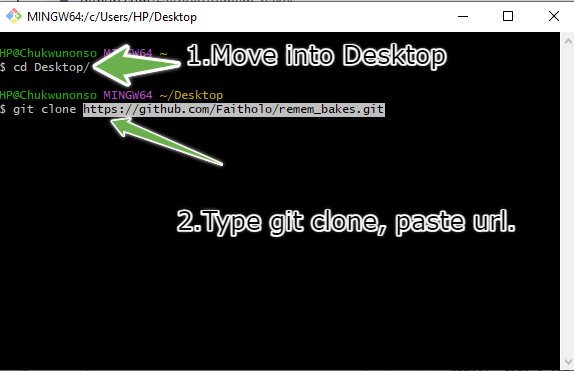
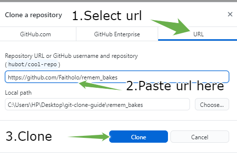

# Introduction to GitHub

## Table of content
- Introduction 
- What is GitHub
- Why GitHub
- Git vs. GitHub
- Clone (Show how to do cloning)
- Pull request (Show how to do a pull request)
- Commit (Show how to do a commit)
- GitHub Desktop vs. Github CLI
  
## Introduction
The idea of working on fascinating projects is usually enjoyable. However, having answers to "How can we secure the project history and keep track of our progress?" will keep us on the safe side. Let us answer these questions using Git and GitHub.


## What is GitHub?

The words "Git" and "Hub" makeup GitHub. Let's briefly discuss Git before moving on to what GitHub is.

### What is Git?
 Git is a distributed version control system (DVCS), which means that your local machine will have an exact mirror copy of the full source code and history. Globally, Git is the most adopted version control system in terms of popularity. We could credit this widespread adoption to its compatibility on Windows, MacOS, ond Linux operating systems. Below is a walkthrough of the installation process using Windows Operating System. Go [here](https://git-scm.com/.) to download Git to your machine.


GitHub is a platform for hosting Git repositories on a distant server or the internet. GItHub simplifies connecting with developers across the globe. It offers you the chance to improve your skills by contributing to open source projects of others.  Open source are projects that you can contribute to and modify. Git is essential to GitHub which means that GitHub depends heavily on Git.

> Just so you know, repository means folder. You may also hear some people  refer to repository as "repo" which is a short form for it.

To use GitHub, you need to create an account or sign up by visiting the [GitHub website.](https://github.com/) 

## Why GitHub

| Features      | Why use GitHUB |
| ----------- | ----------- |
| 1. Security      | With GitHub, securing your projects with top level security only takes a few seconds.       |
| 2. Ease of Use      | GitHub is suitable for seasoned developer, early career programmers,  designers and writers.       |
| 3. Socials   | GitHub is built with the idea that people are social beings, making it simple for you to connect and cooperate with other developers from across the world and growing your network.        |
|4.  Productivity    |  GitHub simplifies working independently on a personal project as well as with a team for a collaborative project.       |
|5.  Open Source Contribution      | Similar to humanitarian services, improving open source project is easy using GitHub.         |
| 6. Education      |  GitHub is host to millions of free repository you can utilize when learning new concepts or preparing for interviews.        |
| 7. Personal  Development    |  GitHub education offers student access to frontendmasters, a platform where they can gain on demand tech skills.        |


## Git vs Github

| Git      | GitHub |
| ----------- | ----------- |
| Git can protect your project from anywhere even without an online connection      | GitHub requires connection to save your work on the remote server.       |
|  Git is a software   | GitHub is a service        |
|  Git is distributed.    | GitHub is centralized meaning that it is controlled by an authority.       |
| Git does not manage user data.      | GitHub  manages user data.       |
| Git was created by Linus Torvalds.      | GitHub  was collectively created by Chris Wanstrath, P. J. Hyett, Tom Preston-Werner, and Scott Chacon       |
| Git is written in C programming language      | GitHub  is developed with Ruby on Rails       |
| Git was first launched in 2005.      | GitHub was launched in 2008.      |


### Clone (How to clone)

Git clone is used to copy a repository that already exists on the cloud into your machine. It provides all the files and history of the codebase. Cloning can be done using HTTPS or SSH code. Let clone a repository using HTTPS. 

Assuming you found the project you want to clone to your desktop, 

1. Click on the *fork* button
2. Click on the *code* button located on the right side of the screen beside the *Go to file* and *add file*.
3. Copy the HTTPS url. 
4. Move into your desktop folder in your terminal.
5. Type  *git clone*  and paste the HTTPS url then hit enter. Yay! You have cloned your first repository.

 The below code describes step four and five above.

 ```
    cd Desktop
    git clone HTTPS url
```   
<br>


<br>



> To learn how you can clone using GitHub desktop. 
<br>




<br>
> Changes you make to projects will be effected only if you have write permissions to the repository. This restriction enables GitHub to protect projects.

<br>

### Commit (How to commit)

Git commit is always preceded by a very popular command known as the git add. Imagine the git add as a command used to bring all the files we want to take a snapshot of to the stage. The git commit is the command that takes the snapshot. Only staged files can be committed. Committed files represent a safe version of your project. This files will only be changed when you instruct Git to do so.

```
    git commit -m "This is how to commit"
    
    The flag m stands for message.
```

 *To correct an error in commit message use*

```
 git commit --amend “This is the correct message”
```

### Pull request (How to do a pull request):

Collaboration is one key features of GitHub. Effective team work necessitates communication. When you pull request, the project owner examines the changes and either accept or reject the change. Pull request helps with efficient communication. You can perform pull requests via GitHub, GitHub Desktop, GITHUB CLI, etc. After submitting a pull request, a page comparing the two branches will show up so you can view the differences. 

 *Here is how you can pull request.*

<br>

> Open the cloned folder in your favorite Integrated Development Environment for example Visual Studio Code.

<br>

*Open the terminal in VS Code using* 

```
    cmd + shift + ~
```

```
git checkout -b “correct-spelling-error” 
 ```   
    The command creates a new branch called *correct-spelling-error*  
    
    Make changes.

   1. git status 
   2. git diff
   3. git add file name or git add . to add all
   4. git commit -m “made spelling correction”
   5. git push origin correct-spelling-error

> Go back to GitHub you should find a green     button that says *compare and pull request* click it and give a descrription of the change you made > and create a pull request. 

### GitHub Desktop
GitHub Desktop, in a nutshell, makes it simpler to work with both local and cloud-hosted repositories and simplifies your work. Eliminating any potential roadblocks and Increasing your productivity are the two main objectives of GitHub desktop.

Visit [this link](https://desktop.github.com/) to get it installed on your local computer.


### GitHub CLI

GitHub CLI stands for GitHub Command Line Interface. It helps you to connect with GitHub from your terminal without having to switch applications. 

Think of the GitHub CLI when you consider ease. It eliminates the need for switching from the terminal to web browser or the GitHub desktop application while trying to access or host a repository. GitHub CLI makes you become accustomed to working with the terminal, which is a crucial skill. You like feeling like a hacker, after all.


Install [GitHub CLI](https://cli.github.com/).

> Run this command in the terminal

```
    gh auth login
```


## GitHub Desktop vs. Github CLI

| GitHub CLI      | GitHub Desktop |
| ----------- | ----------- |
| GitHub CLI is an interface in your terminal      | GitHub desktop uses Graphic User Interface       |
|  GitHub CLI is a command line tool   | GitHub desktop is an application.        |
| GitHub CLI uses commands     | GitHub desktop does not use commands.       |
| Downloading GitHub CLI takes smaller memory.       | GitHub desktop requires more memory space.      |


With what we have covered, you should be able to work with both Git and GitHub and keep track of the projects you are working on without been afraid of losing any of your files and projects. Keep building!

