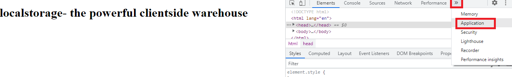
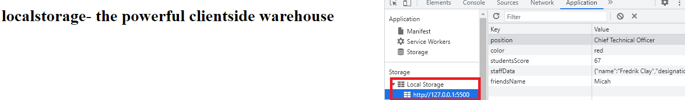
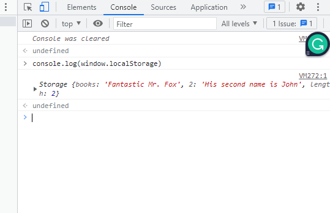
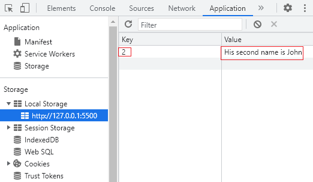
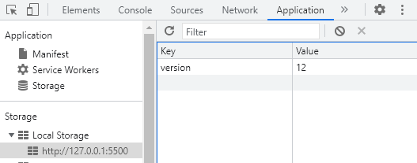
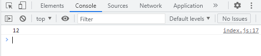
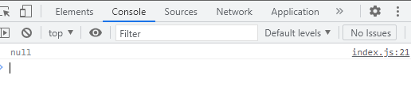
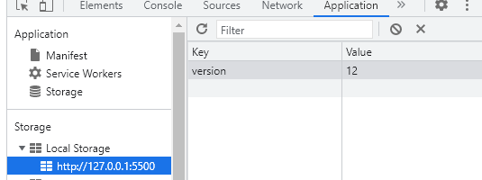
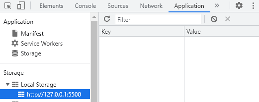

# JavaScript localStorage: The powerful client-side warehouse

## We'll cover the following

- What is localStorage
- A quick explanation of session storage
- The Same Origin Policy(SOP)
- Local Storage Methods
  - get method
  - set method
  - clear
  - length 
- Local storage data 
- The Data Model
- Why use local storage?
- Any limitations?
- A simple project is possible
- Wrapping up


If you use browsers, you should be familiar with the word 'cookies'. Cookies store key/value pairs on the client side. It then transfers this data to the server on every HTTPS request. 

The data communicated with servers can cause security threats, especially on malicious sites. As a result of this, Netscape introduced a feature called Webstorge API. This API helps keep this threat at a minimal level. 

Web storage is not a substitute for browser cookies. It is a web application security system for obtaining data from a user and storing it on the browser. These stored items are not shared with the server as cookie does. The web storage comprises the distinct localStorage and sessionStorage. 

Come along as we explore the potent local storage.

### Session Storage 
The Session storage keeps data key-value pairs for one session. It is temporary storage and is suitable for one-time transactions on web pages.

The session storage feature is considered both per instance and per origin. Per instance indicates that each window or tab stores its data. Per origin denotes that it abides by the same origin policy.
This storage clears all data at the end of every session or closing of the window.
### Local Storage
Local storage stores persistent key-value pairs on your browser. Closing the window or browser does not remove the data in the storage. Local storage is per origin. To set or get items from both local storage and session storage, we use a type of JavaScript API. Before discussing these API methods, let's understand the same origin policy.






### Same Origin Policy (SOP)

When you log in to 'http://www.bankoftherich.com', your user authentication is stored. If you visit another website 'http://www.malicious.com'. By default the browser allows the malicious website to make and get requests to and from your bank site. The malicious site does it by reusing the authentication. The malicious site is empowered to do everything possible on the bank site. Some of these activities could be criminal such as initiating new transactions. 

The same origin policy as a security feature prevents the above scenario. Websites of the same origin have read and write access. But access is denied websites with different origins. Origin means the same `URL scheme(protocol)`, `host(domain)`, and `port number`. The protocol for web applications can either be `HTTP` on `port 80` or the `HTTPS` on `port 443`. During user authentication with HTTP cookies, `SOP` ensures no sensitive credentials leaks. SOP restricts only script files. Scripts loaded from the same origin have access to all the data. Alternately, Cascading Style Sheets(CSS) and images resource are visible. 


Given a website http://www.understandingsop.com/80

- The protocol is `http`
- `//www.understandingsop.com` is the domain
- `80` is the port
  
When all three matches, the same origin criterion is satisfied. File path variations have no impact and you activate the default port when a port is not specified.

These are the results when you compare this URL, "https://www.sameoriginpolicy.com/page.html," to the URLs listed in the table:


| Compared URL    | Outcome | Reasons|
| ----------- | ----------- | -------- |
|https://www.sameoriginpolicy.com/|Success|Same protocol, domain and port|
| http://www.sameoriginpolicy.com/html   | Failure|Different protocol|
| https://www.striver.com/html   | Failure|Different domain|
|https://www.sameoriginpolicy.com/page2.html| Success |Thesame protocol, host and port|
| https://www.sameoriginpolicy.com:8080/page.html | Failure|Different port|


### Local Storage Methods
Browsers declare the global objects  on the window.

```
    window.localStorage
```
Type this short code inside the console, It should give you all the items inside the local storage and the length of the storage.



Window.localStorage outputs all the items in the local storage and the length.

- Writing to local storage

The method `localStorage.setItem` allows you to write to the localStorage. You will be required to use the key value pair combination like we have already learned. 

`Syntax`

```
  localStorage.setItem("key", value)

```

```
localStorage.setItem(2, "His second name is John")

```
If you check the storage, you should see a key `2` with value of `His second name is John`




<br>


- Getting items from the local storage

For you to read the local storage using the `key`, you need the `getItem` method. 

` syntax`

```
  localStorage.getItem(key)

```

```
  localStorage.setItem('version', 12);
  
  console.log(localStorage.getItem("version"))

```
when you check the console, you should see `12`





Trying to get an item that has not been set into the local storage will return `null`. For example, we didnt set any item with the key variety. Hence in the console, we have `null`.


```
  console.log(localStorage.getItem("variety"))
```


- Removing an item from the local storage.

To remove an item from the local storage window, all you need to do is have the key of the item inserted into the simple method below.

`syntax`
```
  localStorage.removeItem(key)
```

```
  localStorage.setItem('version', 12);
```


```
    localStorage.removeItem('version')

```


- Clear Storage

This method removes all the key- value pairs we have initially set to the local storage window.

`syntax`

```
  localStorage.clear()
```

for example lets say you set this items into your storage

```
  localStorage.setItem("friendsName", "Micah")

  localStorage.setItem("studentsScore", 67)

```

To remove them from the storage

```
  localStorage.clear()

```
Note this is not a selective method like the `removeItem`. 

<br>

- Local storage length

To get the number of all items in the local storage section of the browser, use this method:

`syntax`

```
  localstorage.length();
```

```

  localStorage.setItem("friendsName", "Micah")

  localStorage.setItem("studentsScore", 67)

  console.log(localStorage.length)
  
```

### Local storage data
The browser window stores local storage data. This value is received in the form of key-value pairs. It is akin to the JavaScript Object and the JavaScript Object Notation(JSON) syntax. Strings are the data types supported by local storage. Storage capacity varies across browsers. Opera and Safari browsers stores 5 megabytes of data. Internet Explorer, Chrome, and Firefox can receive up to 10 megabytes.


- Passing an object into localStorage

```
   const staffData = {
     name: "Fredrik Clay",
     designation: "Software Engineer",
     Age: 40,
     Hobby: "Golfing",
   }

   localStorage.setItem("staffData", staffData);
   console.log(localStorage.getItem("staffData"))  

```
When an object stored directly into the local storage, it shows `[object object]`. Which obviously isn't what anyone would want.

To successfully place an object into the local storage, you need to turn it into a string using the JSON.stringify method.


```
    const staffData = {
    name: "Fredrik Clay",
    designation: "Software Engineer",
    Age: 40,
    Hobby: "Golfing",
  }

  localStorage.setItem("staffData", JSON.stringify(staffData));
  
  console.log(localStorage.getItem("staffData"))
```


After stringifying, you now have a JSON string. To convert the JSON string back to an object, we will use the JSON.parse method. A better way to picture JSON.parse is as a data exchanger. 

```
  let staffDataUpdated = localStorage.getItem("staffData")
  
  console.log(JSON.parse(staffDataUpdated))
```


### The Data Model
Local storage adopts the [Associative Array Data model](https://en.wikipedia.org/wiki/Associative_array). In this key/value pair model, each key has to be unique and cannot be used more than once. For every repeated key, the succeeding key is used to replace the preceeding key. Take for example:


Local storage adopts the [Associative Array Data model](https://en.wikipedia.org/wiki/Associative_array). In this key/value pair model, each key has to be unique and cannot be used more than once. For every repeated key, the succeeding key replaces the preceeding key. Consider this as an illustration:

```

    localStorage.setItem("color", "green")

    localStorage.setItem("color", "blue")

    localStorage.setItem("color", "red")

```

 - Check the storage window, you will see that the key `color` gets the value of `red`. It didn't get green or blue.


 Another example

```
  localStorage.setItem("position", "Software Engineer")

  localStorage.setItem("position", "Senior Engineer")

  localStorage.setItem("position", "Chief Technical Officer")
```

Because we used the `position` for all three entries, which violates the Associative Data Model, the position will be used for only the last entries.


### Why use local storage?
1. Super easy and concise syntax.
2. Larger storage capacity compared to cookies.
3. Higher security level as data is not shared with server.
4. For thesame domain, data can be accessed across different windows.
5. Compatibilty across various browsers
6. Stores persistent data that can be accessed offline.

### Some limitations
1. localStorage is not suitable for storing sensitive data.
2. To use other data types on localStorage, you need to some JavaScript methods.
3. Local storage can be used to track how often a user visits a page and also his activities which can be used for targeted avertisement.
  
### Wrapping up
Now when building simple applications, you can use local storage. It will store data for offline and online access. But of course, local storage is not made for delicate data, so don't store them there. With the help of the simple Javascript APIs discussed, you can decide what to store and update at any time. While doing that, keep data models and types at the back of your mind to prevent replacing values. 